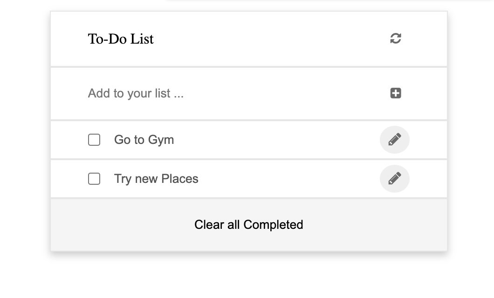

# Todo List

> Todo list Project.


# Live Demo

https://thermiee.github.io/Todo-List/
## Built With

- HTML
- CSS
- JS
- Webpack
- Lighthouse (An open-source, automated tool for improving the quality of web pages. It has audits for performance, accessibility, progressive web apps, SEO and more).
- Webhint (A customizable linting tool that helps you improve your site's accessibility, speed, cross-browser compatibility, and more by checking your code for best practices and common errors).
- Stylelint (A mighty, modern linter that helps you avoid errors and enforce conventions in your styles).
- ESLint

To get a local copy up and running follow these simple example steps.

### Prerequisites
The basic requirements for building the executable are:
* A working browser application (Google chrome, Mozilla Fire fox, Microsoft edge ...)
* VSCode or any other equivalent code editor
* Node Package Manager (For installing packages like Lighthouse, webhint, stylelint & eslint used for checking for debugging bad codes before deployment)


## Getting Started


#### Cloning the project
```
https://github.com/Thermiee/Todo-List
```


To get a local copy up and running follow these simple example steps.

## Getting packages and debugging with Webhint
```
npm init -y

npm install --save-dev hint@6.x
```
##### For validation detection using Webhint Run
```
npx hint .
```
##### from parent source directory

## Getting packages and debugging with Stylelint
```
npm install --save-dev stylelint@13.x stylelint-scss@3.x stylelint-config-standard@21.x stylelint-csstree-validator@1.x
```
##### For validation detection using Stylelint Run
```
npx stylelint "**/*.{css,scss}"
```
##### from parent source directory

## Getting packages and debugging with Eslint
```
npm install --save-dev eslint@7.x eslint-config-airbnb-base@14.x eslint-plugin-import@2.x babel-eslint@10.x
```
##### For validation detection using Eslint Run
```
npx eslint .
```
##### from parent source directory


## Authors

👤 **Emmanuel Jolugbo**

- GitHub: [@Thermiee](https://github.com/thermiee)

## 🤝 Contributing

Contributions, issues, and feature requests are welcome!

Feel free to check the [issues page](../../issues/).

## Show your support

Give a ⭐️ if you like this project!

## Acknowledgments

- Hat tip to anyone whose code was used
- Inspiration
- etc

## 📝 License

This project is [MIT](./MIT.md) licensed.